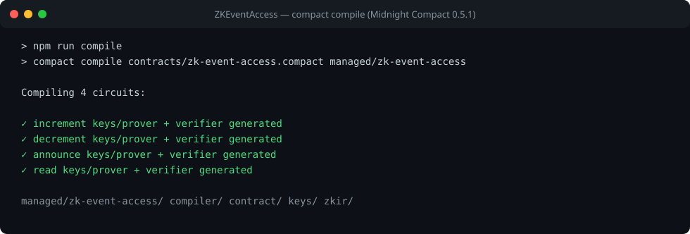
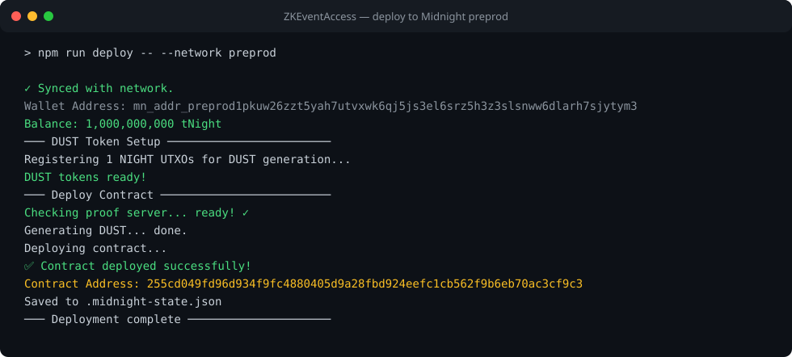

# ZK Event Access

> A privacy-preserving event access dApp on Midnight: anyone can audit the credential count on-chain, but the organizer's secret key never leaves their device — every state change is proven locally with zero-knowledge proofs and submitted from the browser via Lace.

## Live Demo

[PASTE LIVE URL AFTER DEPLOYING FRONTEND]

## Contract Address

| Network  | Address                                                            |
|----------|--------------------------------------------------------------------|
| Preprod  | `255cd049fd96d934f9fc4880405d9a28fbd924eefc1cb562f9b6eb70ac3cf9c3` |

## What This Does

ZK Event Access is an access-credential ledger for events, deployed on Midnight
preprod and driven entirely from the browser:

1. **Connect** your Lace Midnight wallet.
2. The dApp joins the deployed contract and displays the **public credential
   count** straight from the chain.
3. **Issue credential (+1)** — the organizer-only circuit. A zero-knowledge
   proof is generated *in your browser* proving you know the organizer secret,
   then submitted on-chain through Lace.
4. **Verify access (read)** — a public circuit call that also runs as a local
   proof + on-chain transaction.

Circuits:

| Circuit      | Access     | Effect                                              |
|--------------|------------|-----------------------------------------------------|
| `increment`  | organizer  | `counter += 1` (issue one credential)               |
| `decrement`  | organizer  | `counter -= 1` (revoke one credential, floor of 0)  |
| `announce`   | organizer  | publishes a string via explicit `disclose()`        |
| `read`       | public     | returns the current credential count                |

## Privacy Model

- **What is PUBLIC (on-chain, visible to anyone):**
  - `counter` — how many access credentials are currently issued (`Uint<64>`)
  - `organizer` — a domain-separated hash commitment to the organizer's key (`Bytes<32>`)
  - `announcement` — the latest announcement string, published deliberately
  - Every proof that a state transition was authorized

- **What is PRIVATE (private witness / private state, never on-chain):**
  - The organizer's 32-byte secret key held by the browser-side private state
    provider — it never appears in the UI, logs, or network traffic
  - All circuit arguments by default (Compact is private-by-default)

- **What the user PROVES without revealing:**
  - That they know the secret key whose `persistentHash(domain ‖ key)` equals
    the public `organizer` commitment — i.e. "I am the organizer" — plus that
    the counter arithmetic is correct, all inside a succinct ZK proof generated
    locally in the browser.

## Privacy Claim

An on-chain observer sees only: the current credential count, the organizer
*commitment* (an opaque 32-byte hash), any deliberately published announcement,
and valid proofs that transitions were authorized. They **cannot** see the
organizer's secret key, cannot derive it from the commitment (domain-separated
`persistentHash`, preimage-resistant), cannot forge an increment without it
(the circuit fails during local proof generation before anything is sent), and
cannot link the key to any address or identity.

## Tech Stack

- [Midnight network](https://midnight.network) — preprod testnet
- [Compact](https://docs.midnight.network/compact/) — zero-knowledge smart-contract language
- Midnight.js SDK (`@midnight-ntwrk/midnight-js-*`) — providers, contract calls, proof submission
- [Lace](https://www.lace.io/) Midnight wallet — connection, transaction balancing & signing
- React 19 + Vite — frontend
- TypeScript, vitest (contract test suite)
- Docker (local proof server for development)

## Prerequisites

- [Lace Midnight wallet extension](https://www.lace.io/) installed (preprod network, funded with tNIGHT from the [faucet](https://midnight-tmnight-preprod.nethermind.dev))
- Node.js v22 (`nvm install 22 && nvm use 22`)
- Docker running (proof server)

## Run Locally

```bash
# 1. Clone & enter
git clone https://github.com/sanskruti737/ZKEventAccess.git
cd ZKEventAccess

# 2. Use Node 22
nvm use 22

# 3. Install dependencies
npm install

# 4. Start the local proof server (port 6300)
docker run -d --name midnight-proof-server -p 6300:6300 midnightnetwork/proof-server

# 5. Compile the contract (generates managed/counter) and copy ZK assets
npm run compile && npm run copy-zk-assets

# 6. Run the contract test suite (9 tests)
npm test

# 7. Start the dApp
npm run dev
# → open http://localhost:5173, connect Lace, call circuits
```

Notes:
- The prover endpoint comes from your Lace wallet configuration; keep the
  Docker proof server running while using the dApp.
- As the event organizer, you can authorize this browser session by storing
  the deployment-time organizer key once (developer console):
  `localStorage.setItem('zkea.organizerKey', '<64-char hex key>')`.
  The key is kept out of the UI by design — only its hash ever touches the chain.

## Deploy the Frontend

The repo includes `vercel.json`. Easiest path:

```bash
npm i -g vercel
vercel login
vercel --prod          # from the repo root; framework: Vite is auto-detected
```

Or import the GitHub repo at https://vercel.com/new — build command
`npm run build`, output directory `dist`.

## Test Suite

```bash
npm test
```

9 tests cover circuit logic (organizer authorization, counter arithmetic,
impostor rejection), state transitions, and privacy guarantees (secret key
never appears in public artifacts).

## Initial Idea

I planned to build a privacy-preserving event access system using Midnight and
Compact. The system allows authorized users to prove their eligibility to access
an event without publicly revealing their private information. The project uses
zero-knowledge proofs and witnesses to keep sensitive data private while
verifying access securely.

## Screenshots

### Contract compilation (`compact compile`)



### Deployment to Midnight Preprod

Contract address: `255cd049fd96d934f9fc4880405d9a28fbd924eefc1cb562f9b6eb70ac3cf9c3`



## Demo Video

[PLACEHOLDER — I will add the link after recording]
